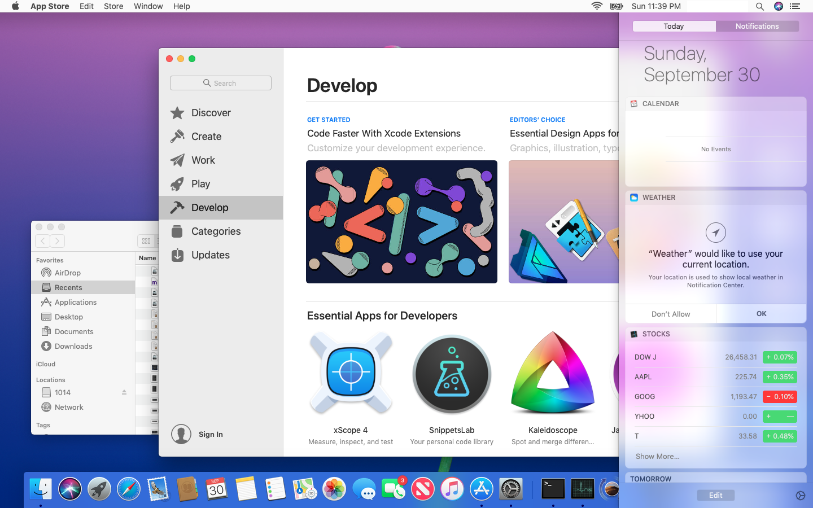
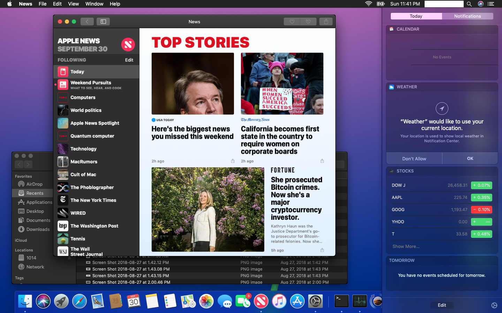
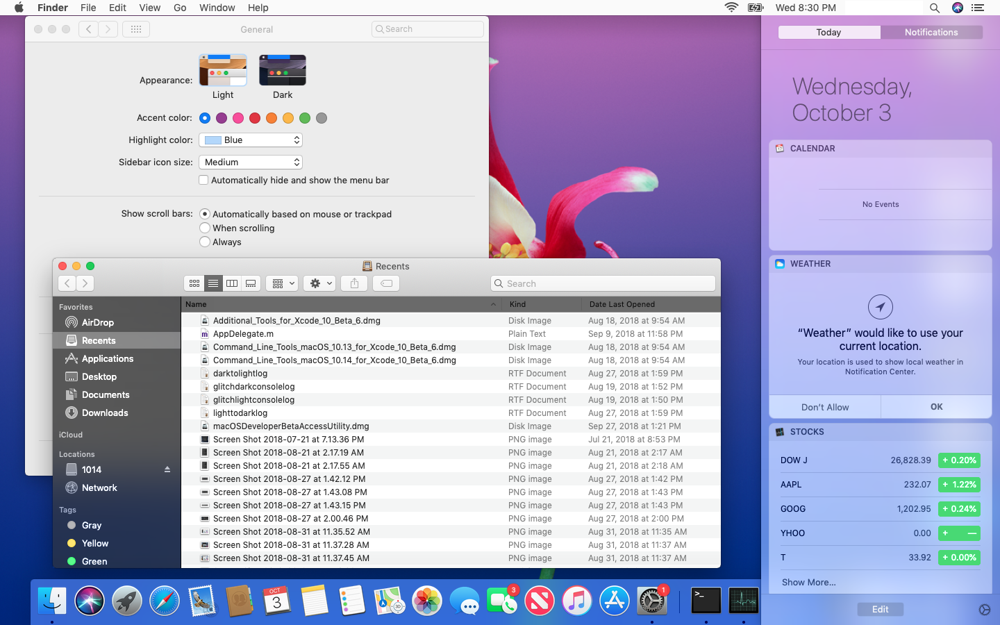
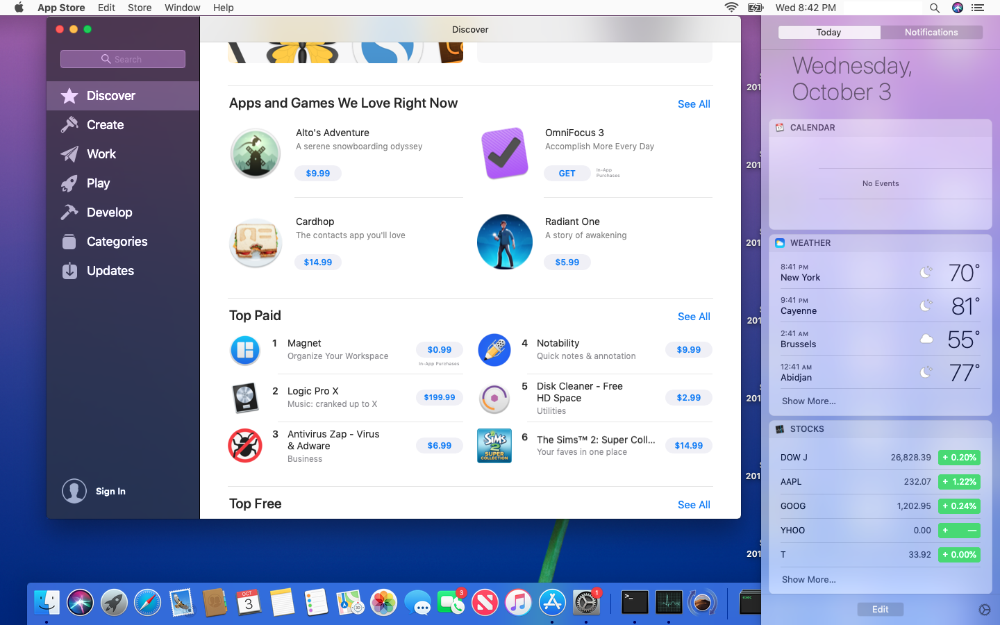

# HybridMode Patchers

**Fix Mojave Light Mode on unsupported machines**

Creds to main collaborators :

- [tiehfood](https://github.com/tiehfood) for the CoureUI inspiration
- [arqueox] (https://github.com/arqueox)
- [Julian Marius Fairfax](https://github.com/Julian-Marius-Fairfax)
- [Tim](https://github.com/TimothyRLaMora734)
- and others...

Motivated by all the folks on dosdude1's Macrumors 10.14 Mojave Unsupported Forum

Motivated by [Pike](https://pikeralpha.wordpress.com/2017/01/30/4398)

## Screen Shots

* "flat" Mode





* "hybrid" Light with solid menubars





## History

* October 8, 2018 : 
  * start of beta testing

## Compatibility Information

see [compatibility table](compatibility.md)

## How to use

**NOTE: These instructions are for experienced users. You must be comfortable with the Terminal and shell command lines**
**General purpose installers and wrappers are still in development.  Stay Tuned for upcoming releases**

1. Disable [SIP](https://developer.apple.com/library/content/documentation/Security/Conceptual/System_Integrity_Protection_Guide/ConfiguringSystemIntegrityProtection/ConfiguringSystemIntegrityProtection.html)[*](https://en.wikipedia.org/wiki/System_Integrity_Protection)
2. Check the [compatibility table](compatibility.md) and select the fix you want to apply
3. Download the latest stable releases from the ```files``` folder
4. Navigate to the proper directory.  Example:
  - For HIToolbox : ```cd /S*/L*/Frameworks/Carbon.framework/Frameworks/HIToolbox.framework/Versions/Current```
  - For AppKit : ```cd /S*/L*/Frameworks/AppKit.framework/Versions/Current```
  - For CoreUI : ```cd /S*/L*/PrivateFrameworks/CoreUI.framework/Versions/Current```
5. Backup the original applications in a safe place (or rename to *.bak)
- ```sudo cp [file] [file].bak```
6. Copy the downloaded patched application to its native location
  - HIToolboxXYZ-12345A : /S*/L*/Frameworks/Carbon.framework/Frameworks/HIToolbox.framework/Versions/Current/HIToolbox
  - AppKitXYZ-12345A : /S*/L*/Frameworks/AppKit.framework/Versions/Current/AppKit
  - CoreUIXYZ-12345A : /S*/L*/PrivateFrameworks/CoreUI.framework/Versions/Current/CoreUI
7. Restart your device
8. Voilà - profit!

## Troubleshootinhg

If the system no longer boots:

- restart in [single-user mode](https://support.apple.com/en-bh/HT201573) or
- restart in [recovery mode](https://support.apple.com/en-us/HT201314) or
- restart from an external boot volume (could be your USB stick)

### In Single User Mode (CMD-S)

- Wait for the console messages to end (note: there may be some spurious ones that pop up from time to time)
- At the prompt mount your volume as read-write (it is read-only by default)
  - ```mount -uw /```
- Navigate to to your framework's "Current" directory and locate the application binary you want to revert. Examples:
  - For AppKit ```cd /S*/L*/Frameworks/AppKit.framework/Versions/Current```
  - For HIToolbox ```cd /S*/L*/Frameworks/Carbon.framework/Frameworks/HITToolbox.framework/Versions/Current```
  - For CoreUI ```cd /S*/L*/PrivateFrameworks/CoreUI.framework/Versions/Current```
- Locate your application backup (**You did back it up - right?**)
- Overwrite the current application with the backup
- restart youre computer
  -```reboot```

### In Recovery Mode (CMD-R) or from a bootable external disk (can be a USB stick) (Press [Option] to select the volume)

- Important: Navigate to your boot volume's root directory:  something like /Volumes/[your Boot Volume Name here]
- Navigate to to your framework's "Current" directory and locate the application binary you want to revert. Examples:
  - For AppKit ```cd /S*/L*/Frameworks/AppKit.framework/Versions/Current```
  - For HIToolbox ```cd /S*/L*/Frameworks/Carbon.framework/Frameworks/HITToolbox.framework/VersionsCurrent```
  - For CoreUI ```cd /S*/L*/PrivateFrameworks/CoreUI.framework/Versions/Current```
- Locate your application backup (**You did back it up - right?**)
- Overwrite the current application with the backup
- restart youre computer
  -```reboot```


## TODOs (in no particular order)

* develop scripts and wrappers
* add a GUI app to wrap this all up neatly
* keep track of tested machines and gpus
* add more documentation
* add more screenshots
