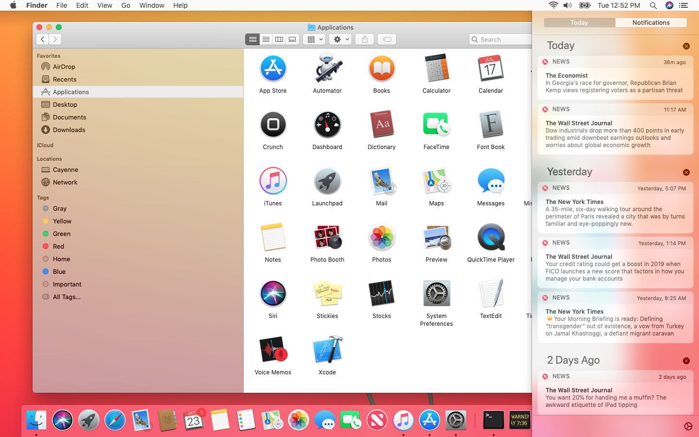
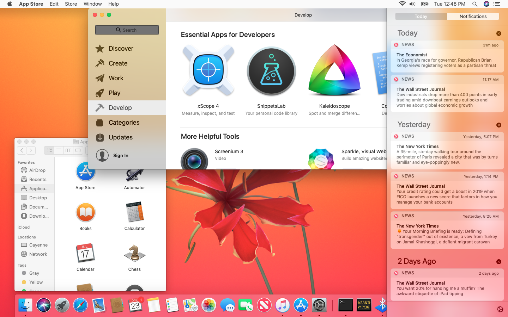
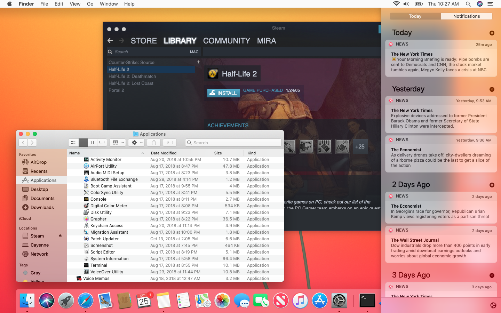
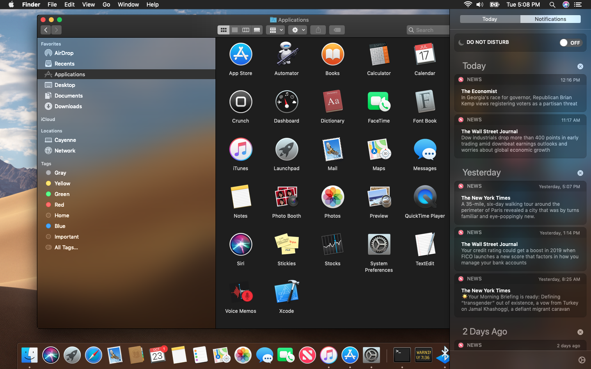
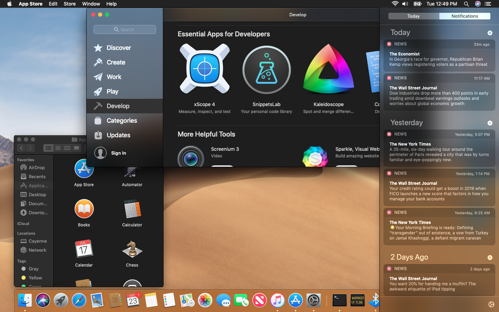

# Hybrid Mode Patchers

Various Fixes for Mojave Light Mode on unsupported macs.

**Please READ this entire page carefully before proceeding.**

**NEW**: 12/14/2018 - Version 1.4.1 for 10.14.2 Released [here](https://github.com/SpiraMira/HybridMode-Public/releases/latest)

* fixes a few v1.4 regressions
* SpotLight translucency and selections (previously invisible now rendered correctly using the default color - like blue)
* menubar titles and menu item selections (the rightmost menuy items were previously rendered incorrectly and sometimes invisible)

**NEW**: 12/24/2018 - pre-release Version 1.4.1 for 10.14.2 Released [here](https://github.com/SpiraMira/HybridMode-Public/releases/tag/v1.4.1) . Some regressions have been addressed (see the associated release notes)

**NOTE**: 12/12/2018 - Version 1.4 for 10.14.2 Released [here](https://github.com/SpiraMira/HybridMode-Public/releases/latest)

**NOTE**: 11/09/2018 - Version 1.3 for 10.14.1 Released with more fixes [here](https://github.com/SpiraMira/HybridMode-Public/releases/latest)

**NOTE**: scripted installs are still in development.  For the moment, the official latest binaries can be found in [Releases](https://github.com/SpiraMira/HybridMode-Public/releases). See below for manual installation instructions (all pretty straightforward once you understand the workflow)

**Creds to main collaborators:**

- Development
  - [tiehfood](https://github.com/tiehfood) for the **excellent CoreUI inspiration and analysis**
- General Testing and collaboration
  - [arqueox](https://github.com/arqueox)
  - [Julian Marius Fairfax](https://github.com/Julian-Marius-Fairfax)
  - [TimothyRLaMora734](https://github.com/TimothyRLaMora734)
  - [webg3](https://github.com/webg3)
  - [junebeetle](https://github.com/junebeetle)
- All other members of the private repo (where the sausage is made...) Sorry in advance if I forgot you...
- See Additional Creds below

## Lovely Screen Shots

### FullScreen "Hybrid" Light Mode with solid menubar





Running 32 bit app Steam...



### FullScreen "Hybrid" Dark Mode with solid menubar





### FullScreen "Flat" Light Mode with solid menubar


### FullScreen "Flat" Dark with solid menubar


### Various UI Element Comparisons

#### TableView Sidebars

| Light Mode | Dark Mode |
|--|--|
|  |  |
| | |

#### SpotLight

| Light Mode | Dark Mode |
|--|--|
|  |  |

## History

- December 14, 2018: v1.4.1
  - fixes v1.4 regressions.  See release notes.
  - Compatible with Mojave 10.14.2
- December 12, 2018: v1.4
  - Compatible with Mojave 10.14.2
- November 09, 2018: v1.3
  - Compatible with Mojave 10.14.1
  - More UI fixes
- November 2, 2018:
  - Mojave 10.14.1 compatibility (v1.2)
- October 25, 2018:
  - Released Universal Binaries (32+64bit support)
- October 24, 2018:
  - updated the hardware-compatibility-list with models tested in the private repo
  - updated the checksums for CoreUI
- October 23, 2018:
  - repo goes public with solid menubar, flat mode and new hybrid mode with CoreUI patches

## What This Is

Some key frameworks have been pacthed to provide the following effects:

| Effect | Framework | Description |
|--|--|--|
| Solid menu bar| HIToolbox | a solid menu bar, white in Light and black in Dark.  For a consistent menu bar presentation |
| Flat appearance with limited transparency | AppKit| To reduce transparency across the board (Light and Dark) without the Accessibility/Preferences shortcomings (Dock, Notification panels etc.) |
| Hybrid transparency | CoreUI | Fixes Light Mode Vibrancy for key UI elements by switching to other "materials" (in SystemAppearance.car) that seem to work on our old systems and GPUs. |

## Who This Is For

- You managed to install Mojave on you unsuported mac
- You have a non-metal GPU (like all the old macbook pros)
- Light Mode "glitches" : ugly grey menu non-transparent menu bar, ugly grey app sidebars, ugly grey spotlight and tooltips etc.
- System tweaks from the command line or Preferences>Accessibility don't totally satisfy or are cumbersome
- You like to switch between modes while keeping a consistent look (without too many hassles)
- You like Dark Mode also and especially transparency in the Dock, Notifications and other system panels

## Notes

- Now allowing Feature Requests via Issues or Pull Requesting (will require a github account - don't have one? Shame on you...)

## Compatibility Information

TBD

## How To Use

**NOTE: These instructions are for experienced users. You must be comfortable with the Terminal and shell command lines.**
**General purpose installers and wrappers are still in development.  Stay Tuned for upcoming releases**

1. Disable [SIP] (If it isn't already)(https://developer.apple.com/library/content/documentation/Security/Conceptual/System_Integrity_Protection_Guide/ConfiguringSystemIntegrityProtection/ConfiguringSystemIntegrityProtection.html)[*](https://en.wikipedia.org/wiki/System_Integrity_Protection)
2. Download the latest stable releases from [here](https://github.com/SpiraMira/HybridMode-Public/releases/latest)
3. Navigate to the proper directory.  Example:
  - For HIToolbox : ```cd /S*/L*/Frameworks/Carbon.framework/Frameworks/HIToolbox.framework/Versions/Current```
  - For AppKit : ```cd /S*/L*/Frameworks/AppKit.framework/Versions/Current```
  - For CoreUI : ```cd /S*/L*/PrivateFrameworks/CoreUI.framework/Versions/Current```
4. Backup the original applications in a safe place (or rename to *.bak)
- ```sudo cp [file] [file].bak```
5. Copy the downloaded patched application to its native location
  - For HIToolbox : /S*/L*/Frameworks/Carbon.framework/Frameworks/HIToolbox.framework/Versions/Current/HIToolbox
  - For AppKit: /S*/L*/Frameworks/AppKit.framework/Versions/Current/AppKit
  - For CoreUI: /S*/L*/PrivateFrameworks/CoreUI.framework/Versions/Current/CoreUI
6. Restart your device
7. Voilà - profit!

## Troubleshootinhg

If the system no longer boots, DON'T PANIC nothing here will brick your system.  Recover using one of the following techniques:

- restart in [single-user mode](https://support.apple.com/en-bh/HT201573) or
- restart in [recovery mode](https://support.apple.com/en-us/HT201314) or
- restart from an external boot volume (could be your USB stick)

### In Single User Mode (CMD-S) [NOTE-This is the preferred and quickest method!]

- Wait for the console messages to end (note: there may be some spurious ones that pop up from time to time)
- At the prompt mount your volume as read-write (it is read-only by default - for you protection)
  - ```mount -uw /```
- Navigate to to your framework's "Current" directory and locate the application binary you want to revert. Examples:
  - For AppKit ```cd /System/Library/Frameworks/AppKit.framework/Versions/Current```
  - For HIToolbox ```cd /System/Library/Frameworks/Carbon.framework/Frameworks/HITToolbox.framework/Versions/Current```
  - For CoreUI ```cd /System/Library/PrivateFrameworks/CoreUI.framework/Versions/Current```
- Locate your application backup (**You DID back it up - right?**)
- Overwrite the current application with the backup. For example:
  - ```cp AppKit.bak AppKit``` or
  - ```cp HIToolbox.bak HIToolbox``` or
  - ```cp CoreUI.bak CoreUI```
- restart your computer
  -```reboot```
  -You should be good to go!

### In Recovery Mode (CMD-R) or from a bootable external disk (can be a USB stick) (Press [Option] to select the volume)

- Important: These instructions are basically the same as Single User Mode but YOU MUST navigate to your boot volume's root directory:  something like /Volumes/[your Boot Volume Name here]
- Navigate to to your framework's "Current" directory and locate the application binary you want to revert. Examples:
  - For AppKit ```cd /Volumes/[your Boot Volume Name here]/System/Library/Frameworks/AppKit.framework/Versions/Current```
  - For HIToolbox ```cd /Volumes/[your Boot Volume Name here]/System/Library/Frameworks/Carbon.framework/Frameworks/HITToolbox.framework/Versions/Current```
  - For CoreUI ```cd /Volumes/[your Boot Volume Name here]/System/Library/PrivateFrameworks/CoreUI.framework/Versions/Current```
- Locate your application backup (**You DID back it up - right?**)
- Overwrite the current application with the backup. For example:
  - ```cp AppKit.bak AppKit``` or
  - ```cp HIToolbox.bak HIToolbox``` or
  - ```cp CoreUI.bak CoreUI```
- restart your computer
  -```reboot```
  -You should be good to go!


## TODOs (in no particular order)

- develop scripts and wrappers (in development)
- add more documentation
- keep track of tested machines and gpus (in development)
- add more screenshots
- publish repo

## Additional Creds

- Motivated by all the folks on dosdude1's Macrumors 10.14 Mojave Unsupported Forum
- Motivated by [Pike](https://pikeralpha.wordpress.com/2017/01/30/4398)
- Also inspired by the work of Isiah Johnson [TMRJIJ](http://osxhackers.net/NightShift "OS X Hackers") and [dosdude1](https://github.com/dosdude1/)
- Floris497
- Many others... This list will grow - stay tuned.
